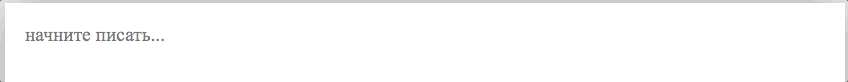

# Флай Типограф #

[](https://www.npmjs.com/package/fly-typograf)
[](https://www.npmjs.com/package/fly-typograf)

Автотипографика текста в полях `<input>`, `<textarea>` и `contenteditable="true"` на лету.

## Что делает Типограф? ##

Верстает текст внутри полей `<input>` и `<textarea>` автоматически при наборе с клавиатуры.



Умеет:
* Заменять кавычки, тире, спецсимволы: `…`, `©`, `®`, `™`, `₽`, `±`, `÷`
* Ставить простые дроби: `½`, `⅓`, `¼`, `⅕`, `⅙`, `⅐`, `⅛`, `⅑`, `⅒`, `⅔`, `⅖`, `¾`, `⅗`, `⅜`, `⅘`, `⅚`, `⅝`, `⅞`
* Умеет ставить минус между числами и `×` между размерными единицами
* Привязывать неразрывным пробелом союзы и предлоги к последующим словам, а частицы к предыдущим
* Ставить степени, градусы, дюймы
* Разрешает писать HTML и комментарии к нему

Пример работы [Типографа](https://spearance.github.io/FlyTypograf.js/example)

> FlyTypograf.js не является полноценной заменой он-лайн сервиса [typograf.ru](https://typograf.ru) и не может им быть, потому что содержит гораздо меньше правил проверки, но он помогает снять до 80% вопросов экранной типографики.

## Как записывать разные символы? ##
| Название | Запись | Замена | Раскладка |
|----------|:------:|:------:|:---------:|
| Кописрайт | `(c)\|(C)` | `©` | — |
| Зарегистрированный знак | `(r)\|(R)` | `®` | английская |
| Торговая марка | `(tm)\|(TM)` | `™` | английская |
| Рубль | `(р)\|(Р)` | `₽` | русская |
| Плюс минус | `+/-` | `±` | — |
| Разделить | `-:-` | `÷` | — |
| Степень | `12^2` | `12²` | — |
| Дюймы | `32^"` | `32″` | — |
| Градусы | `+32С^o` | `+32С°` | — |

## Установка ##

```
npm install fly-typograf
```
## Пример подключения ##

```javascript
import {FlyTypograf} from 'FlyTypograf.js';

const textarea = document.querySelector(`textarea`)

const Typograf = new FlyTypograf(textarea)

const onTextAreaInput = () => {
  Typograf.process()
}

textarea.addEventListener(`input`, onTextAreaInput)
```

## На что обратить внимание! ##

В некоторых гарнитурах шрифтов нет полного набора простых дробей и числовые символы степеней и размеры простых дробей отрисованы по-разному.

Обратите внимание на пары: `½` и `⅐` или `¹` и `⁵`.

Этот нюанс не важен до момента, пока вы не решите написать `12¹⁵`. Единица в степени, например гарнитурой `Times New Roman`, будет значительно меньше пятерки.

Шрифты развиваются и глифы исправляют, возможно, у вас они уже отображаются хорошо, но помните, что так может быть не у всех.
